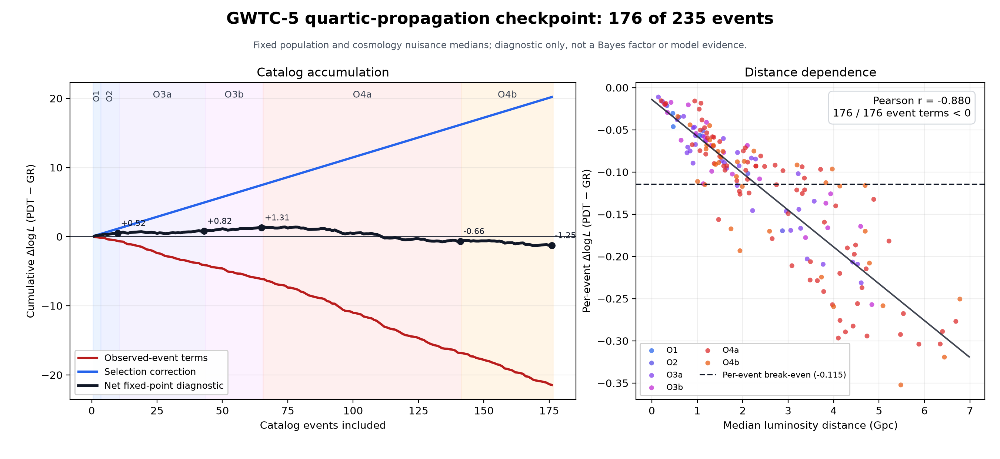

# Structural rigidity of a quartic standard-siren response

This repository contains a Lean 4 proof that carries a conditional quartic
standard-siren response from a local transverse-traceless classification to a
unique cosmological transport law. It asks what an observer can infer when a
conserved two-output system has one visible polarization channel and one
hidden channel, and what redshift curve is forced if the same response
composes over cosmological scale changes.

The principal theorem begins with an arbitrary real two-by-two response matrix
`M` on the plus/cross polarization plane and an arbitrary retained quadratic
weight `0 < s <= 1`. It assumes:

1. `M` commutes with the polarization quarter-turn;
2. `M` is self-adjoint;
3. `Mᵀ M = s I`; and
4. the passive sign branch is selected.

These hypotheses force

```text
M = sqrt(s) I.
```

The result then places this unique exterior block inside the exact dilation

```text
psi -> sqrt(s) psi_visible + sqrt(1-s) psi_hidden.
```

For every finite state and every real diagonal observable, visible and hidden
expectations add to the original expectation. If chirp evolution counts this
complete conserved quantity while strain reads the exterior TT amplitude,
all common source responses cancel and the inferred standard-siren distance is
forced to be

```text
d_inferred = d_true / sqrt(s).
```

This is a classification result: the matrix, source state, observable, and
common response are quantified rather than selected after the calculation.

## From the quartic clock to the passive splitter

The local mechanism now has an exact action-to-channel bridge.  Exchange
symmetry, unit diagonal normalization, and the quartic core weight `1/Q`
force the internal action block

```text
K_Q = [[1, -lambda4],
       [-lambda4, 1]].
```

Its unique positive lower-triangular Gram factor that preserves the ordinary
source ray is

```text
A_Q = [[sqrt(S_Q), 0],
       [-lambda4,   1]].
```

Lean also proves that this is the raw-scale version of the independently
derived determinant-one electric-source frame used in the constraint closure.
The action and constraint calculations therefore use the same canonical
frame.

Its first column already carries retained and hidden amplitudes
`(sqrt(S_Q),-lambda4)`.  Keeping that source column fixed, Gram--Schmidt
produces its unique orientation-preserving orthogonal completion.  Lean proves
the source-ray preservation, Gram-factor uniqueness, projection identity,
orthogonality, orientation, and the absence of a further splitter angle.  It
also proves the exact limitation: a Gram matrix is invariant under arbitrary
left-orthogonal changes of frame.  The physical bridge therefore requires
ordinary stress-energy to select the positive source-preserving frame; the
quadratic form alone does not select a scattering frame.  See
[ACTION_TO_SPLITTER_BRIDGE.md](ACTION_TO_SPLITTER_BRIDGE.md).

The interface datum has now been reduced to one explicit Hamiltonian boundary
coefficient.  For the symplectic quarter-turn `J`, the centered jump law

```text
(I + t_Q J) z_after = (I - t_Q J) z_before,
t_Q = lambda4/(1 + sqrt(S_Q)),
```

has a unique transfer matrix.  Lean proves that it is exactly the passive
splitter above, is orthogonal with determinant one, and is equivalent to the
midpoint impulse equation

```text
J(z_after-z_before) = t_Q(z_after+z_before).
```

It also proves the exact reciprocal degree-eight equation obeyed by `t_Q`.
The coupling and exterior amplitude rationally reconstruct one another, so
Lean proves that they generate the same degree-eight field over the rationals.
The boundary law adds no independent algebraic parameter.  Lean now also
proves that this map is generated by an explicit quadratic type-one boundary
action.  The determinant-one bulk Hamiltonian vector field squares to `-I`,
and the canonical electric source frame conjugates it exactly to `-J`.  In
that frame, the Cayley coordinate `2t_Q` gives the same passive splitter.
Lean further proves that this is the endpoint of the exact continuous
Hamiltonian rotation at `theta_Q=arcsin(lambda4)`, rather than a discrete
approximation.  It now also proves that the electric source frame converts the
bulk Hamiltonian into the unit harmonic oscillator and that the boundary
generator is exactly that oscillator's Hamilton principal function at
`theta_Q`; its phase derivative returns the conserved outgoing Hamiltonian.
The remaining physical premise is that a covariant horizon crossing reduces
to this fixed-mode phase.  See
[HORIZON_INTERFACE_CAYLEY.md](HORIZON_INTERFACE_CAYLEY.md) and
[BULK_TO_BOUNDARY_DYNAMICS.md](BULK_TO_BOUNDARY_DYNAMICS.md).  The oscillator
is no longer an abstract auxiliary model: Lean reduces both circular
helicities of the fixed-momentum transverse-traceless graviton action to that
same canonical oscillator, with the opposite curl eigenvalue fixing the
negative-helicity momentum orientation.  The quartic exterior action is
exactly `S_Q` times the oscillator action for both helicities.  See
[TT_HELICITY_OSCILLATOR_REDUCTION.md](TT_HELICITY_OSCILLATOR_REDUCTION.md).

## The quartic Q specialization

Let `Q` denote the positive real root satisfying

```text
Q^4 = Q + 1,    Q > 1.
```

The PDT proposal supplies the retained quadratic weight

```text
s_Q = 1 - (1 - 1/Q)^2 = (2Q - 1)/Q^2.
```

The general theorem then fixes the dimensionless response

```text
R_Q = d_inferred / d_true
    = 1 / sqrt((2Q - 1)/Q^2),

1.016 < R_Q < 1.017.
```

There is no fitted coefficient in this specialization. Lean also proves exact
algebraic fingerprints for the two observable factors. For the exterior
amplitude `A_Q = sqrt(s_Q)`,

```text
A_Q^8 + 3 A_Q^6 - 2 A_Q^4 + 22 A_Q^2 - 23 = 0.
```

For the distance response `R_Q = 1/A_Q`,

```text
23 R_Q^8 - 22 R_Q^6 + 2 R_Q^4 - 3 R_Q^2 - 1 = 0.
```

Lean now proves that the amplitude polynomial is irreducible over the
rationals, using an explicit Rabin/Frobenius certificate after reduction
modulo five and a monic Gauss-lemma lift. Consequently both `A_Q` and `R_Q`
have minimal-polynomial degree exactly eight; the equations above cannot
collapse to lower degree.

The proof also recovers the quartic generator from the amplitude:

```text
Q = (4 - A_Q^2 + A_Q^6) / (8 - 4 A_Q^2 - A_Q^6).
```

Therefore `ℚ(Q)` is contained in `ℚ(A_Q)`, and Lean proves the relative degree

```text
[ℚ(A_Q) : ℚ(Q)] = 2.
```

This degree-eight observable field is distinct from PDT's registered
degree-twelve joint field `ℚ(ρ,Q)=ℚ(ρQ)`. The numbers describe different
layers: degree four for the quartic generator, degree eight after adjoining
the independent amplitude square root, and degree twelve for the combined
cubic-quartic substrate.

## Unique cosmological continuation

The finite response cannot be applied as the same constant at every source
distance because a propagation effect must approach one at zero path length.
The scale-step proposal instead assigns one response (R_Q) to a
multiplicative scale-factor change by (Q). It gives

```text
N_Q(z) = log(1+z) / log(Q),
R_Q(z) = R_Q ^ N_Q(z) = (1+z)^beta_Q,
beta_Q = log(R_Q) / log(Q).
```

Lean proves that this curve is unique under four conditions: continuity,
strict positivity, multiplication under successive scale changes, and the
one-step value `F(Q) = R_Q`. Thus the power law is not selected from a fitting
family after choosing the exponent. The composition law and the finite
quartic step fix the exponent and the entire curve.

Numerically,

```text
beta_Q  = 0.08333758478067765...
delta_Q = -0.08333758478067765...
alpha_M = 0.16667516956135530...
```

In the modified-gravity class where the squared GW/EM distance ratio equals
the effective gravitational-coupling ratio, Lean proves

```text
G_eff(z) / G_eff(0) = (1+z)^(2 beta_Q),
G_eff(Q-1) / G_eff(0) = Q^2 / (2Q-1).
```

The final equality is the exact inverse-screening factor already obtained in
the local response calculation. The complete derivation and its physical
scope are in [COSMOLOGICAL_QUARTIC_TRANSPORT.md](COSMOLOGICAL_QUARTIC_TRANSPORT.md).

## A falsifiable two-branch result

The physical premise is stated rather than hidden. The biased result applies
when chirp evolution counts complete visible-plus-hidden flux while the
detector reads only the exterior TT amplitude. The repository also proves the
competing placement:

```text
complete flux in chirp, exterior strain -> R_Q = 1/sqrt(s_Q)
same response in chirp and strain      -> R_Q = 1
```

Thus the model cannot continuously retune the response under the submitted
hypotheses. Observations can reject the proposed placement.

## Relation to the literature

Gravitational-wave luminosity distance and its possible difference from
electromagnetic luminosity distance are established in:

- Enis Belgacem, Yves Dirian, Stefano Foffa, and Michele Maggiore,
  [The gravitational-wave luminosity distance in modified gravity theories](https://arxiv.org/abs/1712.08108).
- The same authors,
  [Modified gravitational-wave propagation and standard sirens](https://arxiv.org/abs/1805.08731).

This submission adapts the response-ratio observable to a finite conservative
two-polarization theorem and formalizes the unique positive continuous
multiplicative continuation of its one-step response. It does not claim that
the cited papers contain the Q specialization.

The observational comparison uses the LIGO--Virgo--KAGRA collaboration's
[GWTC-5.0 modified-propagation analysis](https://arxiv.org/abs/2605.27227)
and its [official data release](https://zenodo.org/records/20378418). The fixed
PDT local slope lies at the 62.10th percentile of the released narrow-prior
`c_M` posterior. This establishes present compatibility, not a preference
over general relativity. The released analysis fits a decaying `c_M/E(z)^2`
curve. A direct posterior-density comparison of the sharp local-slope values
gives PDT-to-GR ratios of 0.932 (narrow `H0` prior) and 0.975 (wide `H0`
prior): statistical ties, not evidence for either value.

The exact PDT law is already a native model in the same ICAROGW 2.0.3 release
recorded in the GWTC-5 result files. Its `eps0_astropycosmology` class uses
`dL_GW = (1+z)^eps0 dL_EM`; setting `eps0 = beta_Q` gives the Lean-proved PDT
curve identically. A full test therefore requires no new cosmology code. It
does require rerunning the hierarchical event and injection likelihood,
because the GWTC-5 Zenodo package publishes posterior results rather than the
configured likelihood inputs. The exact rerun is now packaged rather than
merely described. The checksum lock identifies all 235 official event files
(89,295,221,112 source bytes), and the sequential extractor verifies and
compacts one HDF5 file at a time. A second pinned script reconstructs the
marginal PE-prior density and has passed a checksum-locked real event from
each of O1, O2, O3a, O3b, O4a, and O4b (337,982 posterior samples total). The
same evaluator has now processed 182 events through complete O4a and the first
41 of 94 O4b events, covering 12,038,335 posterior samples with finite positive
densities throughout. The machine-readable coverage record is
`gwtc5_pe_prior_audit.json`. The official
1.142 GB cumulative injection file has also been checksum verified and
compacted with the selection fixed at semianalytic SNR above 10 or
real-search FAR below 0.25/year: 1,478,693 injections pass, with no overlap
between the two channels. A native ICAROGW integration diagnostic now runs
the complete event-plus-selection likelihood at both fixed propagation points.
Using two early-run events and all selected injections, every numerical
stability check passed and the diagnostic log-likelihood difference was
`+0.0721` for PDT relative to GR, a statistical tie at this scale. This is a
pipeline check, not model evidence: the publishable comparison still requires
all 235 events and nuisance-parameter marginalization. The pinned inputs,
formulas, commands, machine-readable audit, and real-file integration tests
are recorded in
[EXACT_GWTC5_RERUN.md](EXACT_GWTC5_RERUN.md).

The diagnostic has since been expanded to 182 events: every event through
complete O4a plus the first 41 of 94 O4b events. Its fixed-nuisance difference
is now `-1.4936`: observed-event terms contribute `-22.3786`, while the required
selection correction contributes `+20.8850`. All 182 individual event terms
lean toward GR at this fixed point. The 41-event O4b block contributes
`-0.8366` net, extending the O4a sign reversal. The remaining 53 O4b events
would have to average better than `-0.0866` in their observed-event terms to
return this fixed-point diagnostic to zero. Full nuisance marginalization can
still change the result.



This supersedes the 19-event component split in commit `1fd4f6e`. ICAROGW's
paired-mass normalization uses a Monte Carlo draw on every population update.
The total scale-free likelihood cancels that common factor, but a component
attribution requires the same draw under both hypotheses. The script now
enforces that condition, and a second common draw reproduced every corrected
component to about `1e-13` or better. The earlier 19-event total was unaffected.
Five independent posterior subsamples gave `-1.5193` to `-1.4915`; the detailed
correction and 182-event checkpoint are recorded in
`gwtc5_likelihood_checkpoint_audit.json`.

The full inference runner is now included as `gwtc5_full_inference.py`. It
reconstructs and checks the released FullPop priors and Nessai settings, audits
catalog completeness, and refuses to sample until all 235 events and the
selection archive validate. Its first mode reproduces the collaboration's
published `cM` evidence; the fixed GR and PDT modes use the same nuisance
priors and sampler configuration after that reproduction succeeds.

The Hubble benchmark supplies a possible joint test. With
`chi = Q/rho = 0.9215124457...`, an early-universe value `H0 = 67.4` maps to
the fixed present value `H0 = 73.1406291...`. The released GW posterior is
also statistically indifferent between the joint PDT proxy point and the
corresponding GR benchmark points. This is cross-sector compatibility, not an
independent confirmation or a derivation of the Hubble identification.

## Palomar comparison surface

The five selected results are:

1. `StandardSirenRigidity.quarticStructuralTT_cosmologicalTransport_capstone`;
2. `StandardSirenRigidity.continuousQuarticScaleResponse_unique`;
3. `StandardSirenRigidity.structuralTT_globalFlux_standardSirenDistance`;
4. `StandardSirenRigidity.quarticStandardSirenResponse_minpoly_natDegree`; and
5. `StandardSirenRigidity.quarticExteriorAmplitude_relativeDegree`.

`Challenge.lean` imports only Mathlib and contains their full statements with
intentional proof holes. `Solution.lean` imports the proved development and
transports the source declarations across definitionally identical comparison
definitions. `GravityScreening/QuarticResponseIrreducibility.lean` contains the
mod-five certificate, rational lift, generator-recovery identity, and field
extension proofs. `GravityScreening/CosmologicalQuarticTransport.lean` contains
the multiplicative-response rigidity theorem, redshift specialization, and
local-to-cosmological capstone. `comparator.json` fixes the declaration order
and permitted axioms. `formalization.yaml` records scope, provenance,
literature relations, and exact statement alignment.

The earlier Lorentz spin-two classification and source-reduction declarations
remain in the repository as proof infrastructure. They are not selected again
as the principal Palomar result group.

## Exact scope

The Lean proof establishes the mathematical implication from its displayed
hypotheses, including the redshift law forced by continuous positive path
composition and the one-step value. It does not prove that Nature selects the
proposed observer placement or that a factor-(Q) scale change physically
realizes one response step. It does not derive Newton's constant or formalize
Jacobson's thermodynamic argument.

## Reproduce

The project pins Lean 4.31.0 and Mathlib commit
`fabf563a7c95a166b8d7b6efca11c8b4dc9d911f`.

```bash
lake exe cache get
lake build
lake env lean Challenge.lean
lake env lean Solution.lean
python3 gwtc5_pdt_curve_check.py /path/to/icarogw_fullpop_spectral_cm_narrow.json
python3 gwtc5_fixed_slope_evidence.py \
  /path/to/icarogw_fullpop_spectral_cm_narrow.json \
  /path/to/icarogw_fullpop_spectral_cm_wide.json
python3 prepare_gwtc5_inputs.py --dry-run
python3.12 -m venv gwtc5-prior-env
./gwtc5-prior-env/bin/pip install -r gwtc5_prior_requirements.txt
./gwtc5-prior-env/bin/python evaluate_gwtc5_pe_prior.py \
  gwtc5-data/events/GW240420_175625.npz
./gwtc5-prior-env/bin/python prepare_gwtc5_injections.py \
  /path/to/mixture-semi_o1_o2-real_o3_o4a_o4b-polar_spins_20260410130052UTC-clipped.hdf \
  --output gwtc5-data/gwtc5_cumulative_icarogw.npz
python3.12 -m venv gwtc5-icarogw-env
./gwtc5-icarogw-env/bin/pip install -r gwtc5_icarogw_requirements.txt
./gwtc5-icarogw-env/bin/python gwtc5_likelihood_smoke.py \
  --event-dir gwtc5-data/events \
  --injections gwtc5-data/gwtc5_cumulative_icarogw.npz \
  --reference-result /path/to/icarogw_fullpop_spectral_cm_narrow.json \
  --events GW151012_095443 GW170823_131358 \
  --output gwtc5_likelihood_smoke_audit.json
./gwtc5-icarogw-env/bin/python gwtc5_full_inference.py \
  --mode reference-cm \
  --event-dir gwtc5-data/events \
  --injections gwtc5-data/gwtc5_cumulative_icarogw.npz \
  --reference-result /path/to/icarogw_fullpop_spectral_cm_narrow.json \
  --plan-output gwtc5-runs/reference-cm-plan.json
```

The solution declarations depend only on `propext`, `Classical.choice`, and
`Quot.sound`. None depends on `sorryAx`.

## License

MIT
